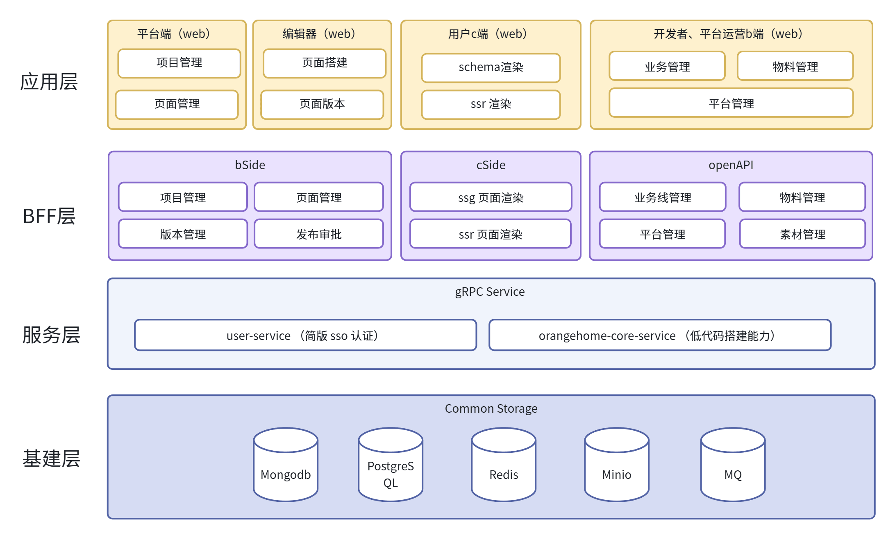

# 7天 0 到 1 全 AI 驱动：我用 AI Agent 落地了一套完整低代码搭建系统

## 前言

AI技术正以前所未有的速度迭代，各类智能体和开发工具层出不穷。为了深入探索AI驱动的研发流程闭环，并真实地摸清当前AI能力的边界，我发起了一个挑战：**从0到1，独立开发一个相对复杂的系统，全程由AI负责执行，而“人”只扮演管理者的角色。**

本文将完整复盘这个项目的**启动、开发与调试**阶段。关于后续的项目部署、迭代与运维等环节，我会在系列文章的后续章节中持续更新，敬请期待。

## 概览

### 使用的AI工具链

-   **核心开发**：Cursor + 2个OpenClaw
-   **辅助工具**：Speckit、GSD (get-shit-done)
-   **需求探讨**：DeepSeek Chat + OpenClaw

### 项目整体架构


### 项目仓库

采用多仓库协作模式，与真实研发场景高度贴合：

| 仓库名称 | 仓库类型 | 仓库描述 | 仓库地址 |
|----------|----------|----------|----------|
| orangehome-main-monorepo | Rush monorepo | 应用层仓库，包含BFF和Web | 本仓库 |
| orangehome-materials | Turbo repo | 低代码平台物料 | https://github.com/ponyorange/orangehome-materials |
| orangehome-core-service | 单仓 | 低代码搭建核心能力 | https://github.com/ponyorange/orangehome-core-service |
| orangehome-user-service | 单仓 | 简版SSO认证 | https://github.com/ponyorange/orangehome-user-service |

### 系统体验

欢迎访问在线体验地址：http://8.148.251.221:6010/platform

---

## 项目启动：从想法到方案

项目启动阶段主要包含三个关键步骤：**明确需求**、**输出技术方案**、**制作UI**。

### 明确需求

如果你的项目已经有明确的产品需求文档（PRD），可以直接跳过此步。

由于我是从零开始构思这个系统，只有模糊的想法，没有现成的产品文档。因此，我需要借助AI工具来输出一份完整、清晰的需求文档，为后续的开发奠定基础，确保我和AI都对“要做什么”有完全一致的理解。

这里我选择的是 **DeepSeek Chat**。原因有二：第一，免费；第二，其深度思考能力在自然语言理解领域表现优异，非常适合进行需求探讨。

**操作流程：**

1.  **让AI扮演资深产品经理**：使用精心设计的提示词模板，与DeepSeek进行多轮对话，逐步完善需求。

    > **提示词示例：**
    > 请扮演一位资深产品经理，协助我完成一份标准的产品需求文档（PRD）。我将提供产品背景信息，请按照以下结构生成初稿，使用Markdown格式。……
    >

2.  **多角色审查（可选，更严谨）**：在第一版PRD生成后，可以让AI分别扮演后端开发、前端开发和测试工程师的角色，对PRD进行交叉审查，找出潜在问题并提出修改建议。

    > **提示词示例：**
    > 请分别扮演【后端开发工程师】、【前端开发工程师】和【测试工程师】三个角色，对以下PRD内容进行审查。我将粘贴具体章节，请从每个角色的角度指出问题，并给出修改建议。
    >

3.  **产出**：根据反馈再次完善，最终得到一份高质量的系统级需求文档和各子模块的详细需求文档。

> **个人体会**：AI在这里产出的需求文档，其结构清晰度和逻辑严谨性，已经超越了绝大多数我见过的PM所写的PRD。强烈推荐大家尝试一下。

### 技术方案

**核心原则：你负责架构设计和技术选型，AI负责完善技术细节。**

为什么不直接把需求文档丢给AI，让它全权负责技术方案呢？难道AI的架构能力不强吗？

并非如此。我甚至相信AI在这方面的能力远超大多数高级工程师。但问题在于，**如果你不能理解和驾驭AI的设计，你就无法掌控整个项目**。项目初期一切顺利，但到了后期进行功能扩展或Bug修复时，代码可能会变得一团糟，让你怀疑AI的能力。这不是AI不行，而是你没有驾驭它。就像一个不会开车的人，出了车祸只会责怪车不好。

当然，如果你完全没有头绪，完全可以与AI探讨。你可以拿着AI提供的技术方案，追问它为什么这样设计，有什么瓶颈，有没有其他替代方案。这个过程本身就是**向AI学习、最终在思想上超越AI的过程**。只有这样，你才能真正地领导AI，而不是被AI领导。AI的价值在于降低了学习成本，帮你快速答疑解惑。

因此，在AI时代，软件工程师的核心价值在于**架构审美能力、业务价值判断能力和独立思考能力**。如果你盲目相信AI，那么你的上限就是AI的上限。而如果你能保持独立思考，不断质疑AI的回答，你将永远凌驾于AI之上。

#### 我的架构设计思路

-   **为什么拆分user-service？** 提供统一的认证能力，相当于一个简版的单点登录（SSO）服务，解耦用户管理与核心业务。
-   **为什么拆分core-service？** 封装低代码搭建的所有通用能力（如Schema解析、组件渲染引擎等），让上层的BFF和前端应用无需关心复杂的内部实现细节。
-   **编辑器如何设计？** 采用**轻内核、高扩展**的插件化架构。内核只负责管理生命周期和全局状态，其余所有功能（如拖拽、图层、属性面板）都通过插件实现，确保核心稳定，功能灵活。
-   **... ...**

#### 技术选型思考

-   **后端语言：Go vs Node.js？** Go在高并发、性能和内存占用上有先天优势。但本项目的重点在于探索AI能力，而非追求极致性能。同时，为了确保我能更好地驾驭AI，我选择了我更熟悉的Node.js生态。
-   **框架：NestJS vs Koa？** API网关、简单的接口服务可以用Koa。但对于这个中大型、业务逻辑复杂的系统，NestJS的模块化、依赖注入和面向切面编程（AOP）能力更胜一筹，因此选择NestJS。
-   **数据库：MongoDB vs PostgreSQL？** 核心业务数据（如用户、项目、页面）结构稳定、关联性强，选择PostgreSQL。而物料、Schema等更倾向于文档形态的数据，结构可能频繁变化，选择MongoDB。
-   **Monorepo工具：Turbo vs Rush？** 超大型企业级项目、对依赖管理有极致要求的选择Rush。我的主应用层虽然复杂，但更追求现代化的构建速度和简洁的配置体验，因此选择了Turbo Repo。
-   **状态管理：Redux vs Zustand？** 除非是跨框架/跨应用的超大全局状态，否则绝大多数场景下，Zustand配合SWR就能以更少的代码量完美覆盖。因此，我们选择Zustand。

> 以上这些选型，你完全可以借助AI作为“高级XX工程师”来获得选型建议和论证。在这个过程中，你不仅能做出决策，更能学到背后的权衡逻辑，但前提是**你必须保持思考，而不是一味采纳**。

#### 核心数据设计

-   **数据表设计**：我先根据需求设计出第一版，再让AI帮我完善字段、索引和关联关系。
-   **数据协议（Schema）设计**：这是整个低代码系统的核心。整个系统的价值，就在于编辑器能否方便快捷地输出这份Schema，而C端能否高性能、高还原度地渲染这份Schema。

我设计的核心Schema结构如下：

‍‍‍```json
{
  "id": "comp_id_xx",
  "type": "VideoPlayer",
  "props": {},      // 组件属性
  "actions": {},    // 组件事件，支持一些JS纯函数的执行
  "style": {},      // 组件样式，主要控制布局和整体风格
  "elementStyles": { // 复杂组件内部元素的样式配置
    "playButton": {} // 例如，播放按钮的样式
  }
}
‍‍‍```

在AI时代，Schema的生成不再高度依赖拖拉拽，完全可以交给AI来完成。因此，在Schema设计上，我们要考虑让AI更容易理解，例如使用更语义化的字段名。未来，90%的低代码搭建操作将由AI完成，拖拉拽将退化为高级功能，仅用于人工微调细节。

当核心设计完成后，就可以借助AI生成完整的、可落地的技术方案。

> **提示词示例：**
> 请基于以下需求和技术背景，为我生成一份完整、可落地的后端技术方案。请以资深后端架构师的视角输出，使用Markdown格式，内容需具体、可执行。
>

-   **产出**：一份系统级技术方案和每个子模块的详细技术方案。一份整体的技术方案能让AI时刻明晰当前开发的模块在整个系统中的角色和位置，从而保证产出的代码更符合整体设计。

### UI设计

为了保证系统整体风格一致，纯粹的“自然语言”控制UI细节是困难的，因此UI设计环节必不可少。

1.  **确定设计语言**：首先确定一个主题色，然后让AI基于此生成一套完整、规范的配色方案，奠定整体设计语言。
2.  **生成原型**：使用画板绘制草图，大致说明模块布局，并辅以自然语言描述。然后将这些输入给Cursor，让它生成一个完整的HTML文件。可以多尝试几次，从中挑选最满意的一个作为UI参考。
3.  **指导开发**：在后续系统实现时，将这个HTML文件作为UI参考提供给Cursor，它能生成高度一致的真实页面，确保UI的完美呈现。

---

## 需求实现：AI Coding的战场

下面介绍我在这场实战中使用的AI编程工具和核心工作流。

-   **Cursor**：订阅了Pro版，20美元/月，但因为用超了（主要是GPT和Opus模型成本较高），当月总花费约50美元（约合人民币350元）。
-   **OpenClaw**：在Coze平台搭建，每月49元，获得40万积分。积分消耗也很快，主要使用的是Kimi 2.5模型。

**一句话总结我的分工策略：Cursor + Speckit 负责开发后端服务和编辑器（复杂度高）；OpenClaw + GSD 负责开发管理端（相对简单）和物料库。**

### Cursor + Speckit 工作流

Speckit是一个强大的工具，能将复杂的开发流程转化为结构化的指令，非常适合与Cursor协同工作。如果你的预算充足，推荐使用Opus 4.6或GPT 5.4模型；若预算有限，Kimi 2.5也是不错的选择。

1.  **初始化项目**：首先安装Speckit，并在项目根目录执行初始化命令。
    ‍‍‍```bash
    specify init . --here --ai cursor-agent --force
    ‍‍‍```
2.  **制定项目宪章**：通过 `/speckit.constitution` 定义项目的核心原则、编码规范和架构约束。
    > **重点**：在此说明本服务在整个系统中的地位，例如“这是一个低代码搭建系统的核心服务，整体架构是……，本服务的职责是……”。
3.  **功能规格**：使用 `/speckit.specify` 粘贴需求文档，并附上UI文件路径及对应的模块信息，明确要“做什么”。
4.  **澄清模糊点**：使用 `/speckit.clarify` 让AI指出需求中不明确的地方，并一一作答，确保需求无歧义。
5.  **生成技术方案**：使用 `/speckit.plan` 粘贴我们之前准备好的技术方案，让AI生成可执行的计划。
6.  **拆解任务**：使用 `/speckit.tasks` 让AI自动将计划拆解为可执行、可排序的任务列表。
7.  **一致性分析（复杂项目推荐）**：对于编辑器这类复杂项目，可以使用 `/speckit.analyze` 检查需求、计划和任务是否对齐。
8.  **编码实现**：最后，使用 `/speckit.implement` 让AI按照计划和任务列表开始编码。

**后续功能迭代流程**：

所有变更，坚持“先改Spec，再改代码”的原则：

1.  `/speckit.specify`：追加新功能、设计稿或验收标准。
2.  `/speckit.clarify`：自动检查新需求是否有歧义。
3.  `/speckit.plan`：自动生成或手动描述具体实现方案。
4.  `/speckit.tasks`：自动规划新任务的实施步骤。
5.  `/speckit.implement`：实现新功能。

### OpenClaw + GSD 工作流

将你的GitHub用户名和临时Token提供给OpenClaw，它就能帮你创建仓库、推送和拉取代码。

1.  **对齐规范**：向OpenClaw明确开发规范。例如，每次开发都必须从主分支拉取新分支，完成后生成Pull Request (PR)链接。为此，我制作了一个`GitHub开发规范`的Skill，可以共享给多个OpenClaw实例使用。
2.  **准备依赖数据**：确保OpenClaw能访问必要的接口文档。如果后端服务在本地，无法公网访问，可以导出一份接口文档发给它。要求OpenClaw在开发时**严格依据文档进行Mock**，并提供一个开关，方便后续切换到真实数据进行联调。只要文档准确，联调通常非常顺利。
3.  **安装GSD**：让OpenClaw安装GSD（get-shit-done）工具，用于任务管理。
4.  **分发任务**：将需求文档和技术方案发给OpenClaw，并用GSD生成具体的执行任务列表。
5.  **编码实现**：让OpenClaw严格按照任务列表，一步一步编码实现。
6.  **实时预览**：在开发过程中，可以要求OpenClaw打开浏览器，让你实时查看页面效果，及时反馈调整。
7.  **代码审查**：开发完成后，OpenClaw会将PR链接发给你，进行代码审查和合并，完成闭环。

---

## 总结与展望

以上就是我近期对AI Coding在复杂项目中应用的探索与实践。从项目启动、技术设计到编码实现，AI已经深度参与其中，并展现了惊人的效率。目前来看，**“人负责架构与决策，AI负责实现与执行”** 的模式是行之有效的。

在后续的系列文章中，我将继续探索AI在项目全生命周期中其他环节的应用，例如：

-   **端到端测试**：特别是复杂Bug的修复。
-   **项目部署与运维**：实现自动化的CI/CD和智能监控。
-   **AI在业务中的赋能**：例如开发一个“页面搭建智能体”或“营销推广智能体”，让AI直接服务于最终业务。

欢迎大家一起交流学习，共同探索AI时代的研发新范式。

# Orangehome Monorepo

基于 [Rush](https://rushjs.io/) 的 monorepo，包含以下项目：

| 项目 | 说明 | 技术栈 |
|------|------|--------|
| `@orangehome/web_platform` | Web 平台前端 | React + Vite + TypeScript |
| `@orangehome/web_builder` | Web 搭建器前端 | React + Vite + TypeScript |
| `@orangehome/server_bside` | B 端服务 | Nest.js |
| `@orangehome/server_cside` | C 端服务 | Nest.js |

## 环境要求

- Node.js：建议使用 **20.x LTS** 及以上（与工具链及团队约定一致）；Rush 校验的版本范围为 `>=18.12.0 <23.0.0`（见根目录 `rush.json` 中的 `nodeSupportedVersionRange`）
- 全局安装 Rush：`npm install -g @microsoft/rush`

## 快速开始

```bash
# 安装依赖（在仓库根目录执行）
rush update

# 构建所有项目
rush build

# 按项目开发
cd apps/web_platform && rushx dev          # 开发 web_platform (端口 3000)
cd apps/web_builder && rushx dev          # 开发 web_builder (端口 3001)
cd apps/server_bside && rushx start:dev   # 开发 server_bside (端口 4000)
cd apps/server_cside && rushx start:dev   # 开发 server_cside (端口 4001)
```

## 常用命令

- `rush update` - 安装/更新依赖
- `rush build` - 构建所有项目
- `rushx <script>` - 在当前项目下执行 package.json 中的脚本（需先 cd 到对应 app 目录）
- `rush list` - 列出所有项目

## 目录结构

```
main-monorepo/
├── apps/
│   ├── web_platform/    # React 前端 - 平台
│   ├── web_builder/     # React 前端 - 搭建器
│   ├── server_bside/    # Nest.js B 端服务
│   └── server_cside/    # Nest.js C 端服务
├── common/
│   └── config/
│       └── rush/        # Rush 公共配置
├── rush.json
└── README.md
```
